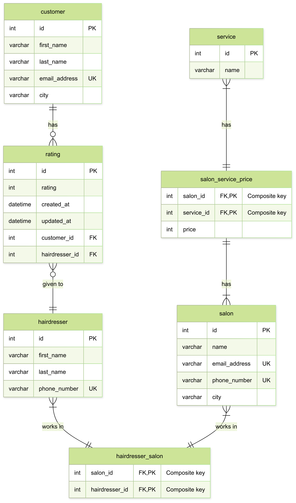

# Design Document

By Simona Trajkovska

Video overview: (https://youtu.be/p8vfjXWl1-Y)

## Scope

This database manages essential entities and relationships involved in operating a salon service platform, where customers can find salons, contact hairdressers, and provide ratings. The scope of the database includes:

* Customers and their basic information
* Hairdressers, with their contact information
* Salons and the services they offer, including pricing
* Services offered across various salons
* Relationships between hairdressers and salons (many-to-many)
* Relationships between salons and services (many-to-many with pricing)
* Customer ratings of hairdressers, with timestamps
* Views to simplify access to common information, such as average ratings and salon-service relationships

Out of scope are advanced scheduling systems, payment integration, customer booking history and employee work shifts.

## Functional Requirements

This database supports:

* CRUD operations for customers, hairdressers, salons, and services
* Assigning hairdressers to multiple salons and salons to multiple services
* Storing and updating customer ratings for hairdressers, including timestamps
* Querying and viewing average ratings per hairdresser
* Retrieving all services and prices offered in a given salon
* Viewing which salons offer a specific service
* Finding the top 3 highest-rated hairdressers via a stored procedure

## Representation

Entities are captured in MySQL tables with the following schema.

### Entities

Below is a detailed explanation of the database schema for the hairdressing salon system.

### Customer

The `customer` table stores information about customers who book services at salons. It includes:

* `id`: A unique identifier for each customer, stored as an `INT`. This column has the `PRIMARY KEY` constraint to ensure each customer has a unique ID, and `AUTO_INCREMENT` is applied to automatically generate sequential IDs for new customers.
* `first_name`: The customer’s first name, stored as `VARCHAR(32)` to accommodate typical name lengths. The `NOT NULL` constraint ensures this field is always provided, as a customer must have a first name.
* `last_name`: The customer’s last name, also stored as `VARCHAR(32)` for consistency with `first_name`. The `NOT NULL` constraint ensures this field is required.
* `email_address`: The customer’s email address, stored as `VARCHAR(255)` to support standard email formats. The `NOT NULL` constraint ensures an email is always provided, and the `UNIQUE` constraint prevents duplicate email addresses, as each customer must have a distinct email.
* `city`: The customer’s city of residence, stored as `VARCHAR(32)` to accommodate typical city name lengths. The `NOT NULL` constraint ensures this field is always provided, as location is relevant for salon services.

All columns are required, and the `UNIQUE` constraint on `email_address` enforces data integrity by preventing duplicate customer records based on email.

### Hairdresser

The `hairdresser` table stores information about hairdressers who provide services at salons. It includes:

* `id`: A unique identifier for each hairdresser, stored as an `INT`. The `PRIMARY KEY` constraint ensures uniqueness, and `AUTO_INCREMENT` automatically generates sequential IDs for new hairdressers.
* `first_name`: The hairdresser’s first name, stored as `VARCHAR(32)` to accommodate typical name lengths. The `NOT NULL` constraint ensures this field is always provided.
* `last_name`: The hairdresser’s last name, stored as `VARCHAR(32)` for consistency with `first_name`. The `NOT NULL` constraint ensures this field is required.
* `phone_number`: The hairdresser’s contact phone number, stored as `VARCHAR(32)` to support various phone number formats (e.g., including country codes or extensions). The `NOT NULL` constraint ensures a phone number is always provided, and the `UNIQUE` constraint prevents duplicate phone numbers, ensuring each hairdresser can be contacted uniquely.

All columns are required, and the `UNIQUE` constraint on `phone_number` ensures that no two hairdressers share the same contact number, maintaining data integrity.

### Salon

The `salon` table stores information about salons where hairdressers work and services are provided. It includes:

* `id`: A unique identifier for each salon, stored as an `INT`. The `PRIMARY KEY` constraint ensures uniqueness, and `AUTO_INCREMENT` automatically generates sequential IDs for new salons.
* `name`: The name of the salon, stored as `VARCHAR(32)` to accommodate typical salon names. The `NOT NULL` constraint ensures a name is always provided.
* `email_address`: The salon’s contact email address, stored as `VARCHAR(255)` to support standard email formats. The `NOT NULL` constraint ensures an email is provided, and the `UNIQUE` constraint prevents duplicate email addresses across salons.
* `phone_number`: The salon’s contact phone number, stored as `VARCHAR(32)` to support various formats. The `NOT NULL` constraint ensures a phone number is provided, and the `UNIQUE` constraint ensures no two salons share the same phone number.
* `city`: The city where the salon is located, stored as `VARCHAR(32)` to accommodate typical city names. The `NOT NULL` constraint ensures the city is always specified, as location is critical for salon operations.

All columns are required, with `UNIQUE` constraints on `email_address` and `phone_number` to maintain distinct contact information for each salon.

### Service

The `service` table stores the types of services offered by salons. It includes:

* `id`: A unique identifier for each service, stored as an `INT`. The `PRIMARY KEY` constraint ensures uniqueness, and `AUTO_INCREMENT` generates sequential IDs for new services.
* `name`: The type of service offered, stored as an `ENUM` with predefined values (`'Haircut'`, `'Blow Dry'`, `'Coloring'`, `'Styling'`, `'Shaving'`, `'Other'`). The `ENUM` type restricts entries to these specific values, ensuring consistency in service categorization. The `NOT NULL` constraint is implicit in `ENUM`, as a value must be selected from the defined list.

This table is designed to standardize service types across salons, with the `ENUM` ensuring data consistency.

### Rating

The `rating` table stores customer ratings for hairdressers, capturing feedback on service quality. It includes:

* `id`: A unique identifier for each rating, stored as an `INT`. The `PRIMARY KEY` constraint ensures uniqueness, and `AUTO_INCREMENT` generates sequential IDs for new ratings.
* `rating`: The customer’s rating score, stored as a `TINYINT` to represent a score from 1 to 10. A `CHECK` constraint ensures the value is within this valid range, maintaining data integrity.
* `created_at`: The timestamp when the rating was created, stored as a `DATETIME`. The `DEFAULT CURRENT_TIMESTAMP` setting automatically sets this to the current date and time when a rating is added.
* `updated_at`: The timestamp when the rating was last updated, stored as a `DATETIME`. This field is automatically updated when the rating is modified, typically via a trigger or application logic.
* `customer_id`: The ID of the customer who submitted the rating, stored as an `INT`. The `NOT NULL` constraint ensures a customer is always specified, and a `FOREIGN KEY` constraint references the `id` column in the `customer` table to ensure the customer exists.
* `hairdresser_id`: The ID of the hairdresser being rated, stored as an `INT`. The `NOT NULL` constraint ensures a hairdresser is always specified, and a `FOREIGN KEY` constraint references the `id` column in the `hairdresser` table to ensure the hairdresser exists.

All columns are required, with foreign keys ensuring referential integrity between ratings, customers, and hairdressers.

### hairdresser_salon (Junction Table)

The `hairdresser_salon` table is a junction table that maps hairdressers to the salons where they work, supporting a many-to-many relationship. It includes:

* `hairdresser_id`: The ID of the hairdresser, stored as an `INT`. The `NOT NULL` constraint ensures a hairdresser is always specified, and a `FOREIGN KEY` constraint references the `id` column in the `hairdresser` table to ensure the hairdresser exists.
* `salon_id`: The ID of the salon, stored as an `INT`. The `NOT NULL` constraint ensures a salon is always specified, and a `FOREIGN KEY` constraint references the `id` column in the `salon` table to ensure the salon exists.
* `PRIMARY KEY`: A composite primary key on `(hairdresser_id, salon_id)` ensures that each hairdresser-salon pair is unique, preventing duplicate associations.

This table enables tracking of which hairdressers work at which salons, with foreign keys ensuring data integrity.

### salon_service_price (Junction Table)

The `salon_service_price` table is a junction table that maps services to salons and records the price of each service at each salon, supporting a many-to-many relationship. It includes:

* `salon_id`: The ID of the salon, stored as an `INT`. The `NOT NULL` constraint ensures a salon is always specified, and a `FOREIGN KEY` constraint references the `id` column in the `salon` table to ensure the salon exists.
* `service_id`: The ID of the service, stored as an `INT`. The `NOT NULL` constraint ensures a service is always specified, and a `FOREIGN KEY` constraint references the `id` column in the `service` table to ensure the service exists.
* `price`: The price of the service at the salon, stored as a `DECIMAL(10,2)` to support precise monetary values (e.g., 29.99). The `NOT NULL` constraint ensures a price is always provided.
* `PRIMARY KEY`: A composite primary key on `(salon_id, service_id)` ensures that each salon-service pair is unique, preventing duplicate entries for the same service at the same salon.

This table allows salons to offer different services at varying prices, with foreign keys ensuring referential integrity.

### Views

To simplify access to common queries:

* `hairdresser_salon_view`: This view joins the `hairdresser`, `hairdresser_salon`, and `salon` tables to display the relationships between hairdressers and salons, including detailed contact information (e.g., hairdresser names, salon names, emails, and phone numbers). It provides a convenient way to retrieve comprehensive data about where hairdressers work without writing complex joins.
* `salon_service_view`: This view joins the `salon`, `salon_service_price`, and `service` tables to show all services offered by each salon along with their prices. It simplifies querying service offerings and pricing across salons.
* `hairdresser_rating_view`: This view aggregates ratings from the `rating` table to calculate and display the average rating for each hairdresser. It joins with the `hairdresser` table to include hairdresser details and uses a `GROUP BY` clause to compute averages, providing a quick way to assess hairdresser performance.

These views enhance usability by predefining common queries, reducing the need for repetitive SQL statements.

### Stored Procedure

* `get_highest_rated_hairdressers`: This stored procedure retrieves the top 3 highest-rated hairdressers based on their average ratings from the `rating` table. It  joins the `rating` and `hairdresser` tables, groups results by hairdresser, calculates the average rating, sorts in descending order, and limits the output to three records. This procedure simplifies the process of identifying top-performing hairdressers for customers or salon management.

This schema is designed to support a robust hairdressing salon management system, ensuring data integrity through primary keys, foreign keys, and unique constraints, while views and stored procedures enhance usability for common tasks.

## Relationships

The below entity relationship diagram describes the relationships among the entities in the database.

As detailed by the diagram:

* One customer can give zero or multiple ratings.One rating can be written by only one customer. (one-to-many)
* One hairdresser can receive zero or multiple ratings.One rating can be assigned to only one hairdresser. (one-to-many)
* One hairdresser can work in multiple salons.One salon can employ multiple hairdressers.(many-to-many)
* One salon can offer multiple services. One service can be offered by multiple salons with different pricing. (many-to-many)

### Optimizations

To enhance query performance for commonly executed operations, the following indexes I have created:

* `salon_name_search` and `salon_city_search` on the `salon` table: These indexes are applied to the `name` and `city` columns, respectively. They improve the speed of queries that search for salons by name or filter salons by city, which are frequent operations when customers browse salons or when administrators generate location-based reports.
* `hairdresser_first_name_search` and `hairdresser_last_name_search` on the `hairdresser` table: These indexes are applied to the `first_name` and `last_name` columns to accelerate lookups and searches for hairdressers by name. This is particularly useful for customers searching for specific hairdressers or for salon management querying staff details.
* `rating_customer_id` and `rating_hairdresser_id` on the `rating` table: These indexes are applied to the `customer_id` and `hairdresser_id` columns, respectively. They optimize queries that retrieve all ratings from a specific customer or to a specific hairdresser, such as when analyzing a hairdresser’s performance.
* `service_name_search` on the `service` table: This index is applied to the `name` column to speed up queries filtering services by type. Since the `name` is an `ENUM`, the index ensures efficient lookups when customers or administrators query available services (e.g., finding all salons offering a “Haircut”).

These indexes are designed to optimize read-heavy operations, such as lookups, filtering, and sorting, which are prevalent in customer-facing applications and salon management tasks.

### Limitations

The current database schema has several limitations that may restrict its functionality in certain scenarios:

* The schema assumes each rating is independent and associated with a single customer and hairdresser. It does not track appointments, booking history, or feedback specific to salons as a whole, limiting the ability to analyze salon-wide performance or customer visit patterns.
* Ratings can only be assigned to individual hairdressers, not to entire salons. This restricts the ability to capture overall customer satisfaction with a salon’s services or ambiance.
* The schema lacks support for employee scheduling, payment processing, or booking time slots, which are critical for operational management in a salon environment.

